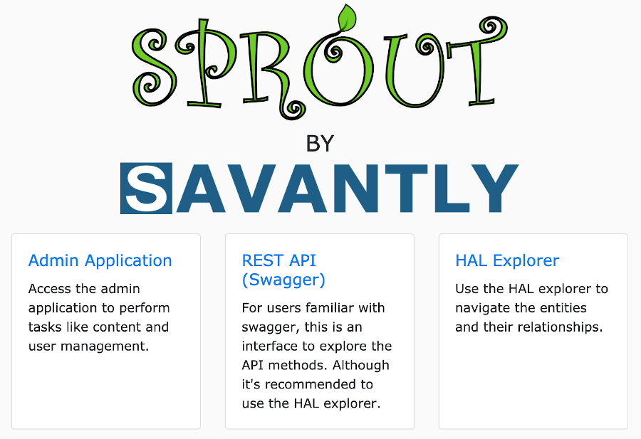

# sprout-spring-boot-starter  

For Spring Boot v2.x  

Opinionated auto-configuration library that provides a fully configured, customizable server application.  
The goal of this library is to reduce the time develop a new app.  
Many functionalities in a server app are boiler-plate code.  
With Spring Boot, this has been drastically reduced, but adding this abstraction reduces it further.  

The auto-configurations in this library can be backed off by providing your own beans.  

Configured Components -  
- Authentication
- Authorization [roles/permissions]
- Entity Auditing
- Rest Repositories [HATEOAS] 
- Entity Serialization
- Multi-Tenancy
- Swagger
- HAL Explorer
  


## Installation 
Include the artifact in a new empty Spring-Boot project -  

Maven - 

	<dependency>
		<groupId>net.savantly.sprout</groupId>
		<artifactId>sprout-spring-boot-starter</artifactId>
	</dependency>

Gradle -  

    implementation 'net.savantly.sprout:sprout-spring-boot-starter'


To use a snapshot version, add the OSSR snapshot repository to your build environment.  
Gradle - 

```
repositories {
	maven {
	    url = uri('https://oss.sonatype.org/content/repositories/snapshots/')
	}
}
```

It's recommended to use the Spring BOM plugin -  

Gradle - 

```
dependencyManagement {
	imports {
		mavenBom org.springframework.boot.gradle.plugin.SpringBootPlugin.BOM_COORDINATES
	}
}
```


Start your Spring-Boot application, and the application is running with sane defaults.  

Access the running application at the default port - http://localhost:8080/ 





## UI Properties

### Well known properties

| Property Name | Description | Default Value |
| --- | --- | --- |
| `HOME_DASHBOARD_ID` | The ID of the dashboard that should be displayed as the 'home' screen | The first dashboard. Created by the system during startup. |


## Rest Starters 
Provides abstract classes for fast Rest service creation - 
- [CrudController](./src/main/java/net/savantly/sprout/rest/crud/CrudController.java)
- [CrudProjectionController](./src/main/java/net/savantly/sprout/rest/crud/CrudProjectionController.java)
- [PageAndSortController](./src/main/java/net/savantly/sprout/rest/crud/PageAndSortController.java)
- [PageAndSortProjectionController](./src/main/java/net/savantly/sprout/rest/crud/PageAndSortProjectionController.java)


Example -  
This provides CRUD endpoints for the `Organization` entity.  
- POST `/api/example` creates a new entity  
- GET `/api/example` retrieves all entities  
- PUT `/api/example/{id}` updates an entity  
- DELETE `/api/example/{id}` deletes an entity  

```
@RequestMapping("/api/example")
public class ExampleCrudController extends CrudController<Organization, String, OrganizationRepository> {

	public ExampleCrudController(OrganizationRepository repository) {
		super(repository);
	}
	
}
```

## Security Customization

Customize the Spring Security configuration by supplying a `SecurityCustomizer` bean.  
This example adds OAuth functionality. 

```
@Bean
public SecurityCustomizer OauthCustomization() {
	return new SecurityCustomizer() {
		
		@Override
		public void configure(HttpSecurity http) throws Exception {
			http.oauth2Client().and().oauth2Login();
		}
	};
}
```

You can add customizations in the bean, or with application properties to setup the oauth config -  

```
spring:
  security:
    oauth2:
      client:
        provider:
          mocklab:
            authorization-uri: https://savantly.mocklab.io/oauth/authorize
            token-uri: https://savantly.mocklab.io/oauth/token
            user-info-uri: https://savantly.mocklab.io/userinfo
            user-name-attribute: sub
            jwk-set-uri: https://savantly.mocklab.io/.well-known/jwks.json

        registration:
          mocklab:
            provider: mocklab
            authorization-grant-type: authorization_code
            scope: openid, profile, email
            redirect-uri: "{baseUrl}/{action}/oauth2/code/{registrationId}"
            clientId: mocklab_oidc
            clientSecret: whatever
```


## Modules
Sprout Modules are used to extend the functionality of the application with little config, and zero code.  
The `sprout-module-content` is an example of a content management system as plugin for this framework.  

See here - [Sprout Content Module](../../modules/content/)  


## Additional Information  

See here for more information - https://github.com/savantly-net/sprout-platform/    


[Garden App]
A full featured application based on the Sprout platform that contains all the official plugins.   

[Garden App]: https://github.com/savantly-net/garden  